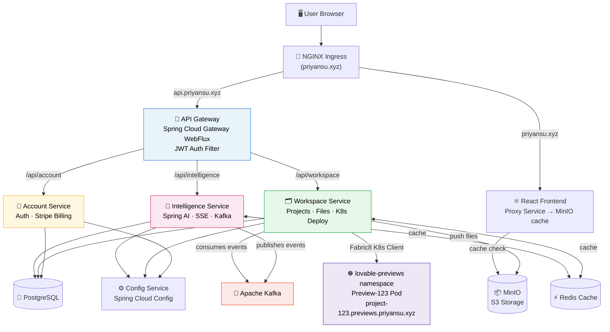
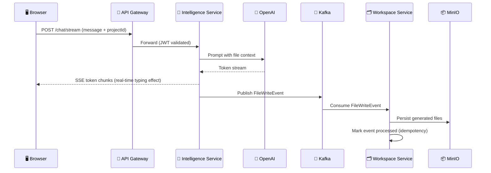
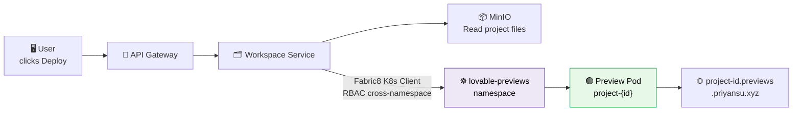
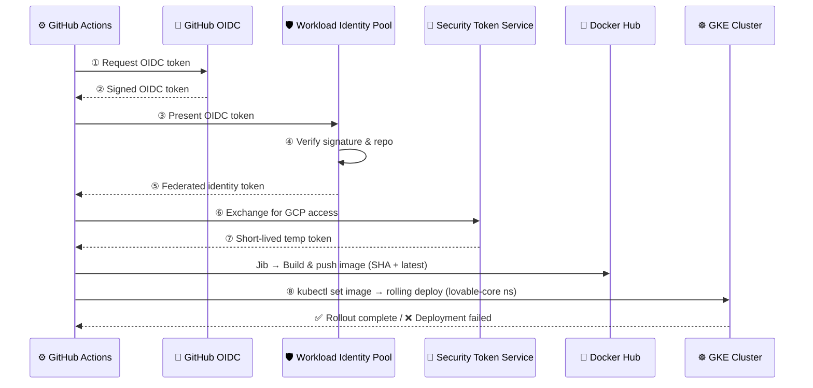

<div align="center">

# 🚀 Distributed Lovable
### AI-Powered Frontend Code Generator — Production Microservices on Kubernetes

**A distributed backend clone of [Lovable.dev](https://lovable.dev) — built with Spring Boot, Spring AI, Kubernetes, and Kafka.**

[](https://priyansu.xyz)
[](https://github.com/priyansusatote/lovable-clone-distributed)
[](https://openjdk.org/projects/jdk/21/)
[](https://spring.io/projects/spring-boot)
[](https://cloud.google.com/kubernetes-engine)
[](https://hub.docker.com/u/priyansusatote)

> 💬 **Describe your app** → 🤖 **AI generates code** → 📦 **Files saved to MinIO** → ☸️ **Live on Kubernetes in seconds**

</div>

---

## 🌐 Live Links

| | Link |
|--|------|
| 🌍 **App** | [priyansu.xyz](https://priyansu.xyz) |
| 📦 **Docker Hub** | [hub.docker.com/u/priyansusatote](https://hub.docker.com/u/priyansusatote) |
| 🐙 **GitHub** | [priyansusatote/lovable-clone-distributed](https://github.com/priyansusatote/lovable-clone-distributed) |

---

## 📖 What Is This?

**Distributed Lovable** is a full-stack, AI-powered app generator. You describe what you want to build in natural language, and the system:

1. Streams AI-generated code back to your browser via **SSE (Server-Sent Events)**
2. Orchestrates file persistence through **Kafka Sagas** + **MinIO S3**
3. Deploys your project as a live **Kubernetes Preview Pod** with its own subdomain

### ✨ Key Features
| Feature | Details |
|---------|---------|
| 🤖 **AI Code Generation** | Spring AI + OpenAI, real-time token streaming via SSE |
| ☸️ **K8s Live Previews** | Isolated preview pods per project in `lovable-previews` namespace |
| 💳 **Stripe Billing** | Subscriptions, Checkout sessions, Customer Portal, Webhooks |
| 📦 **MinIO Storage** | All project files stored as S3-compatible objects |
| 🔄 **Kafka Saga** | Decoupled, idempotent file-write events between services |
| 🔐 **JWT Auth** | Stateless, shared across all services via `common-lib` |
| 🚀 **Keyless GitOps** | GitHub Actions → Workload Identity Federation → GKE deploy |

---

## 🏗️ System Architecture



### Service Discovery & Configuration
All services auto-register with **Netflix Eureka** (discovery-service) and pull runtime config from **Spring Cloud Config Server** (config-service).

---

## 🧩 Microservices

| Service | Port | Role |
|---------|------|------|
| `api-gateway` | `8080` | Reactive JWT auth filter, load-balanced routing |
| `account-service` | `8081` | User signup/login, Stripe subscriptions |
| `workspace-service` | `9020` | Project CRUD, MinIO files, K8s preview deploy |
| `intelligence-service` | `8082` | Spring AI, SSE streaming, Kafka orchestration |
| `config-service` | `8888` | Spring Cloud Config Server |
| `discovery-service` | `8761` | Netflix Eureka Server |
| `common-lib` | — | Shared JWT, `AuthUtil`, security configs, DTOs |

---

## 🔄 Core Flows

### 1. AI Code Generation & File Persistence (Kafka Saga)



---

### 2. Live Kubernetes Preview Deployment



---

### 3. CI/CD — Keyless GCP Auth (Workload Identity Federation)



> 🔐 **No service account keys stored anywhere.** Pure OIDC token exchange via Workload Identity Federation.

---

## 📡 API Reference

All routes are exposed through the API Gateway.

### 🔐 Auth — `/api/account`

| Method | Endpoint | Description |
|--------|----------|-------------|
| `POST` | `/auth/signup` | Register a new user |
| `POST` | `/auth/login` | Login, returns JWT |
| `GET` | `/me/subscription` | Get subscription info |
| `POST` | `/payments/checkout` | Create Stripe Checkout session |
| `POST` | `/payments/portal` | Open Stripe Customer Portal |
| `POST` | `/webhooks/payment` | Stripe webhook handler |

### 🗂️ Workspace — `/api/workspace`

| Method | Endpoint | Description |
|--------|----------|-------------|
| `GET` | `/projects` | List user's projects |
| `GET` | `/projects/{id}` | Get project by ID |
| `POST` | `/projects` | Create new project |
| `PATCH` | `/projects/{id}` | Update project |
| `DELETE` | `/projects/{id}` | Soft delete project |
| `POST` | `/projects/{id}/deploy` | Deploy to K8s preview |
| `GET` | `/projects/{id}/files` | Get file tree |
| `GET` | `/projects/{id}/files/content?path=` | Get file content |

### 🤖 Intelligence — `/api/intelligence`

| Method | Endpoint | Description |
|--------|----------|-------------|
| `POST` | `/chat/stream` | **SSE** — Streamed AI code generation |
| `GET` | `/chat/projects/{projectId}` | Get chat history |

---

## 🛠️ Tech Stack

### Backend
| Category | Technology |
|----------|-----------|
| Language | Java 21 |
| Framework | Spring Boot 4.0.3 |
| Cloud | Spring Cloud 2025.1.0 — Eureka, Gateway, Config, OpenFeign |
| AI | Spring AI 2.0.0-M2 + OpenAI |
| Security | Spring Security + JJWT 0.12.6 |
| Database | PostgreSQL + pgvector · Spring Data JPA |
| Messaging | Apache Kafka |
| Caching | Redis |
| Object Storage | MinIO (S3-compatible) |
| K8s Client | Fabric8 Kubernetes Client 7.3.1 |
| Payment | Stripe Java SDK 31.1.0 |
| Mapping | MapStruct 1.6.x + Lombok |
| Containers | Google Jib Maven Plugin 3.4.4 |

### Infrastructure (GKE)
| Component | Type | Namespace |
|-----------|------|-----------|
| All services | `Deployment` | `lovable-core` |
| Preview pods | Dynamic `Pod` | `lovable-previews` |
| Kafka, MinIO, Redis, PostgreSQL | `StatefulSet` | `lovable-core` |
| Ingress + TLS | Nginx Ingress + Wildcard SSL | cluster-wide |

---

## 🗃️ Repository Structure

```
Distributed_Lovable/
├── api-gateway/            # Spring Cloud Gateway WebFlux — JWT auth filter
├── account-service/        # User auth, Stripe billing
├── workspace-service/      # Projects, MinIO files, K8s Fabric8 deploy
├── intelligence-service/   # Spring AI, SSE, Kafka Saga orchestration
├── config-service/         # Spring Cloud Config Server
├── discovery-service/      # Netflix Eureka Server
├── common-lib/             # Shared: JWT, AuthUtil, DTOs, security filters
└── k8s/
    ├── services/           # Deployments + Services per microservice
    ├── stateful/           # Kafka, MinIO, Redis, pgvector StatefulSets
    ├── infra/              # Cluster infrastructure configs
    ├── proxy/              # Nginx Ingress rules
    └── tlls_certificate/   # TLS wildcard cert configs
```

---

## 🚀 Local Development

### Prerequisites
- Java 21+ · Maven 3.9+ · Docker Desktop

### Startup Order

```bash
# Step 1: Install shared library (always first)
cd common-lib && ./mvnw clean install -DskipTests

# Step 2: Start infrastructure (Postgres, Redis, Kafka, MinIO via Docker)

# Step 3: Start services in dependency order
cd discovery-service    && ./mvnw spring-boot:run   # :8761 — Eureka
cd config-service       && ./mvnw spring-boot:run   # :8888 — Config
cd account-service      && ./mvnw spring-boot:run   # :8081 — Auth + Billing
cd workspace-service    && ./mvnw spring-boot:run   # :9020 — Projects + Files
cd intelligence-service && ./mvnw spring-boot:run   # :8082 — AI + Chat
cd api-gateway          && ./mvnw spring-boot:run   # :8080 — Gateway
```

### Required Environment Variables

| Variable | Used By |
|----------|---------|
| `OPENAI_API_KEY` | intelligence-service |
| `JWT_SECRET` | all services |
| `DB_PASSWORD` | account, workspace, intelligence |
| `MINIO_ROOT_USER` / `MINIO_ROOT_PASSWORD` | workspace, intelligence |
| `STRIPE_SECRET_KEY` | account-service |
| `STRIPE_WEBHOOK_SECRET` | account-service |

> ⚠️ Never commit secrets. Use Kubernetes `Secret` objects in prod, `.env` files locally.

---

## 🌟 Key Design Decisions

### ☸️ Kubernetes-Native Previews
`workspace-service` uses the **Fabric8 Kubernetes Client** to spin up isolated preview pods dynamically in the `lovable-previews` namespace. A cross-namespace RBAC `RoleBinding` grants it the exact permissions needed — no cluster-admin, principle of least privilege.

### 🔄 Kafka Saga Pattern
`intelligence-service` publishes file-write events after AI generation. `workspace-service` consumes and persists files to MinIO, tracking processed events in a `ProcessedEvent` table for idempotency — no double-writes even on retries.

### 📡 Server-Sent Events Streaming
`ChatController` returns `Flux<ServerSentEvent<StreamResponse>>` — AI tokens are pushed to the browser one-by-one as they arrive from OpenAI, creating a real-time "typing" effect without WebSockets.

### 🔐 Shared JWT via `common-lib`
JWT validation, `AuthUtil`, and `SecurityFilterChain` configs live in one shared Maven library. All services import it — consistent auth, zero duplication.

---

## 👨‍💻 Author

**Priyansu Satote**
- 🌐 [priyansu.xyz](https://priyansu.xyz)
- 🐙 [github.com/priyansusatote](https://github.com/priyansusatote)

---

## 📄 License

[MIT License](LICENSE)

---

<div align="center">
  <sub>Built with ❤️ using Spring Boot · Spring AI · Kubernetes · Kafka · and a lot of coffee ☕</sub>
</div>
